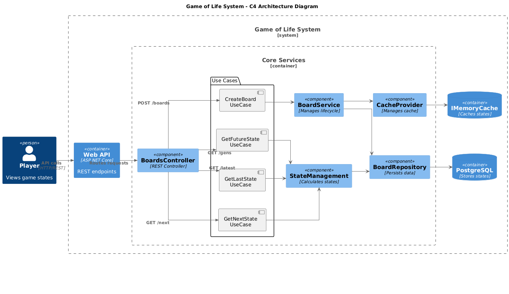
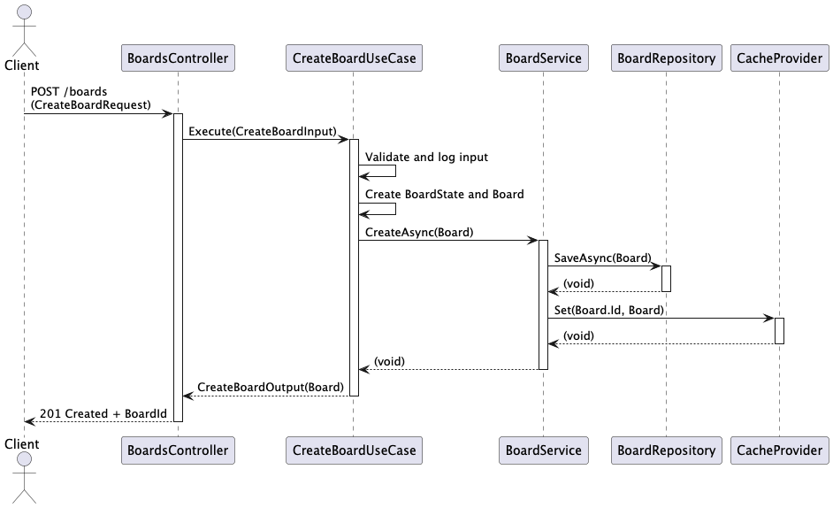

# Game of Life API

This is a .NET 9 Web API that simulates [Conway’s Game of Life](https://en.wikipedia.org/wiki/Conway%27s_Game_of_Life), a cellular automaton where a grid of cells evolves according to a set of simple rules.

The API allows you to:
- Create and initialize boards
- Retrieve the state of a board
- Advance the board to the next generation
- Delete a board

## 📁 Project Structure

| Path                         | Description                                                       |
|------------------------------|-------------------------------------------------------------------|
| `GameOfLife.Api/`            | ASP.NET Core Web API project (e.g., Controllers, Program.cs)      |
| `GameOfLife.Business/`       | Business logic, use cases, entities and Domain Entities           |
| `GameOfLife.Infrastructure/` | Infrastructure implementations (e.g., Dependencies, Repositories) |
| `GameOfLife.Tests/`          | Unit and integration tests                                        |
| `docker-compose.yml`         | Docker Compose setup for the API and PostgreSQL                   |

---

## 🚀 Getting Started

### Prerequisites

- [.NET 9 SDK](https://dotnet.microsoft.com/en-us/download/dotnet/9.0)
- [Docker](https://www.docker.com/)
- [Docker Compose](https://docs.docker.com/compose/)

---

## 🛠️ Running the API with .NET CLI

To build and run this API locally using the .NET CLI:

### 🔧 Build the project

```bash
dotnet build
```

### ▶️ Run the API
```bash
dotnet run --project GameOfLife.Api
```

### 🔄 Run migrations
```bash
dotnet ef database update --project GameOfLife.Api
```

### 📦 Restore dependencies (if needed)
```bash
dotnet restore
```

---

## 🐳 Running the Project with Docker & Docker Compose

```bash
# 1. Clone the repository
git clone https://github.com/alissonb13/game-of-life-api.git
cd game-of-life-api

# 2. Build and start the API and PostgreSQL containers
docker-compose up --build
```
### ✅ Services
- #### 🧠 Game of Life API
  - Available at: https://localhost:7097/swagger
  - Swagger UI is enabled in development mode.

- #### 🐘 PostgreSQL Database (Accessible on port 5432)
  - Port: 5432
  - User: conway
  - Password g@m30fl1f3
  - Database: game_of_life

> ℹ️ Ensure that port 5432 is free on your machine, and that Docker is installed and running.
---

## 🧪 Running Tests

```
cd GameOfLife.Tests

# Run all tests
dotnet test
```
Tests are written using xUnit and cover use cases, controller, and other business logic classes.

---
## 📖 API Documentation
Swagger is available during development:

🔗 https://localhost:7097/swagger

JSON Spec: /swagger/v1/swagger.json



---
## 📡 BoardsController — Endpoints Overview
This controller handles all operations related to the game board.

## 📥 Create a New Board



**POST** `/boards`

Creates a new board based on the initial state provided.

**Request Body:**

```json
{
  "grid": [
    [0, 1, 0, 0, 0],
    [0, 0, 1, 0, 0],
    [1, 1, 1, 0, 0],
    [0, 0, 0, 0, 0],
    [0, 0, 0, 0, 0]
  ]
}
```
**Response (201 Created)**
```json
{
  "id": "cfe3561b-0327-4662-a027-49e8591fd10d"
}
```

## 📄 Get the Last Board State


**GET** `/boards/{boardId}/states/latest?generationMaxValue=100`

Retrieves the most recent state of the board, optionally limited by a maximum generation number.

Path Parameter:

- boardId: The unique ID of the board.

Query Parameter:

- generationMaxValue: (Optional) Maximum number of generations to consider.

**Response (200 OK):**
```json
{
  "generation": 3,
  "state": [
    [0, 0, 0, 0, 0],
    [1, 0, 1, 0, 0],
    [0, 1, 1, 0, 0],
    [0, 1, 0, 0, 0],
    [0, 0, 0, 0, 0]
  ]
}
```

## ⏭️ Get the Next Board State


**GET** `/boards/{boardId}/states/next`

Advances the board to the next generation based on Conway’s Game of Life rules.

Path Parameter:

- boardId: The unique ID of the board.

**Response (200 OK):**
```json
{
  "generation": 3,
  "state": [
    [0, 0, 0, 0, 0],
    [1, 0, 1, 0, 0],
    [0, 1, 1, 0, 0],
    [0, 1, 0, 0, 0],
    [0, 0, 0, 0, 0]
  ]
}
```

## 🔮 Get Future Board State


**GET** `/boards/{boardId}/states/{generations}`

Returns the state of the board after advancing a specific number of generations.

Path Parameters:

- boardId: The unique ID of the board.

- generations: The number of generations to evolve.

**Response (200 OK):**
```json
{
  "generation": 10,
  "state": [
    [0, 0, 0, 0, 0],
    [0, 1, 0, 1, 0], [0, 0, 1, 0, 0],
    [1, 1, 1, 0, 0],
    [0, 0, 0, 0, 0]
  ]
}
```
---

## ♻️ Conway's Game of Life Rules
1. Any live cell with two or three live neighbors survives.

2. Any dead cell with exactly three live neighbors becomes a live cell.

3. All others live cells die in the next generation. Similarly, all other dead cells stay dead.

---

## 🛠️ Technologies
ASP.NET Core 9

Entity Framework Core

PostgreSQL

Docker + Docker Compose

Swagger / OpenAPI

xUnit (tests)